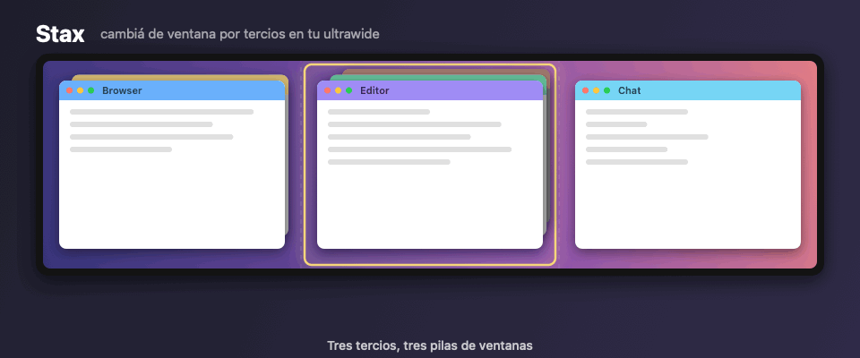

<p align="center">
  
</p>

<h1 align="center">Stax</h1>

<p align="center">
  Cambiá de ventana por tercios en tu monitor ultrawide, como si cada tercio fuera un monitor aparte.
</p>

<p align="center">
  
</p>

Stax es una app de barra de menú para macOS. Divide la pantalla en columnas (por defecto, tres tercios) y
te deja moverte entre las ventanas apiladas en cada columna con atajos de teclado globales. Es la
experiencia de tener tres monitores, en uno solo.

**¿Por qué?** En un ultrawide es natural repartir las ventanas en tercios. Pero cuando en un tercio hay
varias apps una detrás de otra, ⌘⇥ te lleva a cualquier lado y ⌘` sólo cicla las ventanas de la misma
app. Stax hace que el ciclo sea *por tercio*.

## Cómo funciona

- Cada ventana visible del escritorio actual se asigna a la columna donde cae el **centro** de su frame.
- Dentro de cada columna las ventanas forman una pila ordenada de adelante hacia atrás.
- La **columna activa** es la de la ventana que tiene el foco (configurable: también puede ser la que está bajo
  el puntero).

| Atajo | Acción | Qué hace |
|---|---|---|
| ⌘` | `cycleNext` | Trae al frente la ventana del fondo de la pila de la columna activa (`[A,B,C] → [C,A,B]`) |
| ⌘⇧` | `cyclePrev` | Manda la frontal al fondo (`[A,B,C] → [B,C,A]`) |
| ⌃⌘← | `focusColumnLeft` | Foco a la ventana frontal de la columna de la izquierda |
| ⌃⌘→ | `focusColumnRight` | Foco a la ventana frontal de la columna de la derecha |

⌘` reemplaza al atajo nativo de macOS (que sólo cicla las ventanas de la misma app).
Sólo se sube la ventana objetivo: si una app tiene ventanas en dos columnas, las otras se quedan donde estaban.

## El menú


Desde el ícono ⫼ de la barra de menú:

- **Estado**: si tiene el permiso de Accesibilidad y si los atajos están activos, con la lista de atajos
  configurados.
- **Columna 1 / 2 / 3**: la pila de ventanas de cada columna (● la frontal, ○ las de atrás), con ▶ en la
  columna activa. Elegí una ventana del submenú para traerla al frente.
- **Columnas**: 2, 3 o 4 columnas.
- **Columna objetivo**: *Ventana con foco* (por defecto) o *Bajo el puntero*.
- **Abrir config.json** / **Recargar config** (⌘R): para cambiar atajos y ajustes finos.
- **Salir de Stax** (⌘Q).

<br clear="right">

## Instalación

1. Compilar y armar el bundle (firmado con tu certificado de desarrollo si tenés uno, para que el permiso de
   Accesibilidad sobreviva a los rebuilds):

   ```bash
   scripts/bundle.sh                                                    # firma ad hoc
   SIGN_IDENTITY="Apple Development: Tu Nombre (XXXXXXXXXX)" scripts/bundle.sh
   cp -R build/Stax.app /Applications/
   open /Applications/Stax.app
   ```

2. **Accesibilidad**: Ajustes → Privacidad y seguridad → Accesibilidad → agregar `Stax.app`.
   Hace falta tanto para interceptar los atajos como para reordenar ventanas.

3. Para que arranque al iniciar sesión: Ajustes → General → Ítems de inicio → agregar Stax.

## Configuración

`~/.config/stax/config.json` (se crea con los defaults la primera vez; "Recargar config" en el menú ⫼):

```json
{
  "columns": 3,
  "columnSelection": "focused",
  "hotkeys": [
    { "key": "`", "modifiers": ["command"], "action": "cycleNext" },
    { "key": "`", "modifiers": ["command", "shift"], "action": "cyclePrev" },
    { "key": "left", "modifiers": ["control", "command"], "action": "focusColumnLeft" },
    { "key": "right", "modifiers": ["control", "command"], "action": "focusColumnRight" }
  ],
  "raiseOnlyTargetWindow": true,
  "minimumWindowSize": 120,
  "verbose": false
}
```

- `columnSelection`: `focused` (columna de la ventana con foco) o `pointer` (columna bajo el mouse).
- `hotkeys[].key`: un carácter (`"\`"`, `"1"`), un nombre (`left`, `right`, `up`, `down`, `tab`, `space`,
  `escape`, `return`, `delete`) o `"keycode:50"`. Los caracteres se comparan sin modificadores, así ⌘⇧` sigue
  siendo "`" y no "~".
- `hotkeys[].modifiers`: combinación de `command`, `option`, `control`, `shift`.
- `hotkeys[].action`: `cycleNext`, `cyclePrev`, `focusColumnLeft`, `focusColumnRight`.
- `raiseOnlyTargetWindow`: usa la API privada de SkyLight (técnica de AltTab/yabai) para subir sólo esa
  ventana. En `false` usa Accessibility puro, que trae todas las ventanas de la app.
- `verbose`: escribe cada atajo y acción en `~/Library/Logs/Stax.log`.

## Diagnóstico desde la terminal

```bash
.build/debug/Stax list              # ventanas por columna (▶ = columna activa)
.build/debug/Stax do cycleNext 2    # ejecuta una acción sobre la columna 2
tail -f ~/Library/Logs/Stax.log     # con "verbose": true
```

## Ícono y demo

Todo lo visual se genera por código, sin assets externos:

```bash
swift scripts/make-icon.swift && iconutil -c icns Resources/AppIcon.iconset -o Resources/AppIcon.icns
swift scripts/make-demo.swift                             # docs/stax-demo.gif
build/Stax.app/Contents/MacOS/Stax screenshot-menu docs/menu.png   # captura real del menú
```

## Cómo está hecho

- `Hotkeys.swift`: event tap global (`CGEvent.tapCreate`) sobre keyDown; consume el evento cuando coincide
  con un atajo configurado.
- `Windows.swift`: `CGWindowListCopyWindowInfo` (ventanas en pantalla, capa 0, apps regulares) + reparto en
  columnas; la ventana con foco se obtiene por Accessibility.
- `Focus.swift`: `_SLPSSetFrontProcessWithOptions` + `SLPSPostEventRecordTo` + `AXRaise`, con fallback a
  `NSRunningApplication.activate` + `AXRaise`.

## Licencia

MIT. La técnica para subir una sola ventana de una app (`Focus.swift`) es la misma que usan
[yabai](https://github.com/koekeishiya/yabai) y [AltTab](https://github.com/lwouis/alt-tab-macos).
