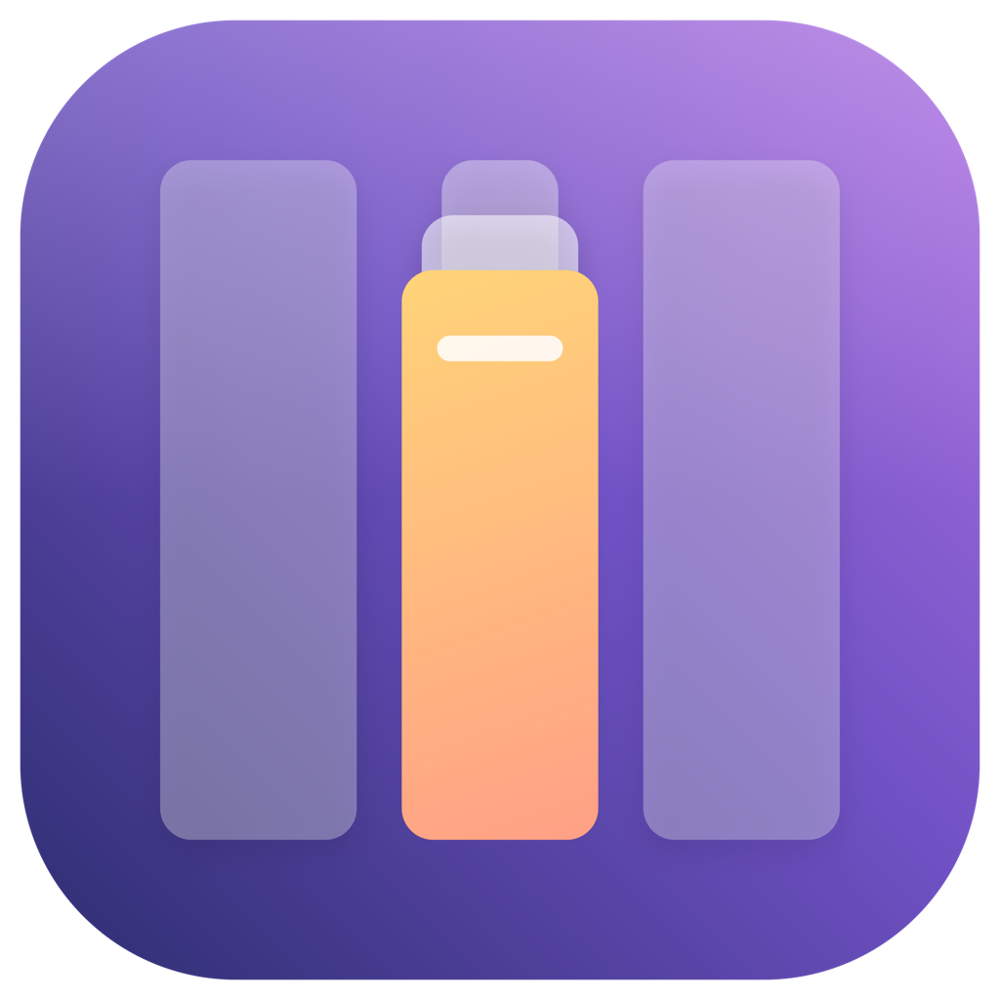
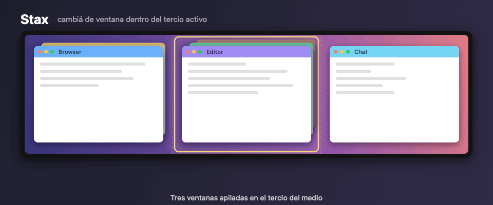
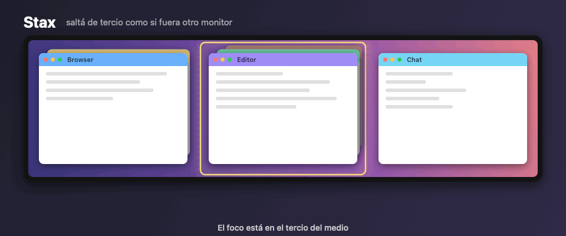
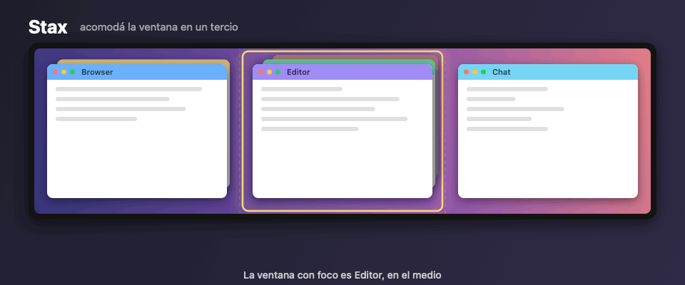
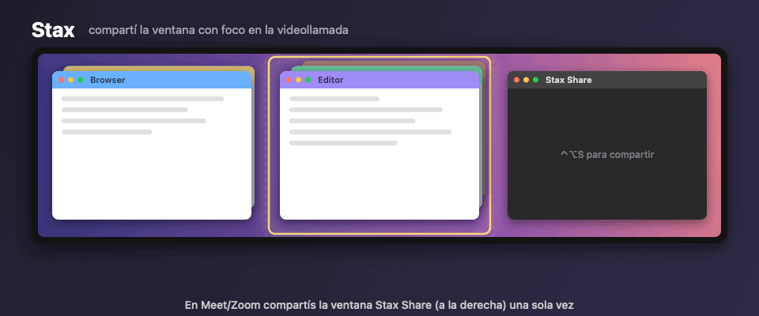
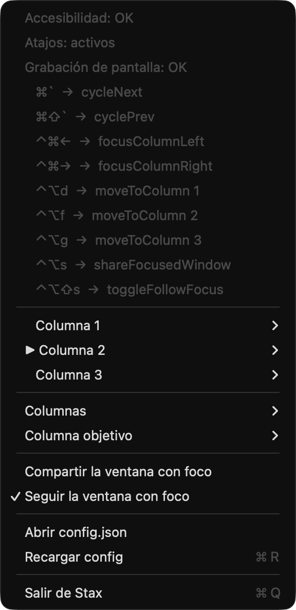

<p align="center">
  
</p>

<h1 align="center">Stax</h1>

<p align="center">
  Cambiá de ventana por tercios en tu monitor ultrawide, como si cada tercio fuera un monitor aparte.
</p>

<p align="center">
  
</p>

Stax es una app de barra de menú para macOS. Divide la pantalla en columnas (por defecto, tres tercios) y
te deja moverte entre las ventanas apiladas en cada columna con atajos de teclado globales. Es la
experiencia de tener tres monitores, en uno solo.

**¿Por qué?** En un ultrawide es natural repartir las ventanas en tercios. Pero cuando en un tercio hay
varias apps una detrás de otra, ⌘⇥ te lleva a cualquier lado y ⌘` sólo cicla las ventanas de la misma
app. Stax hace que el ciclo sea *por tercio*.

## Cómo funciona

- Cada ventana visible del escritorio actual se asigna a la columna donde cae el **centro** de su frame.
- Dentro de cada columna las ventanas forman una pila ordenada de adelante hacia atrás.
- La **columna activa** es la de la ventana que tiene el foco (configurable: también puede ser la que está bajo
  el puntero).

### Ciclar el tercio activo — ⌘` y ⌘⇧`

⌘` trae al frente la ventana del fondo de la pila (`[A,B,C] → [C,A,B]`); ⌘⇧` va al revés. Reemplaza al ⌘`
nativo de macOS, que sólo cicla las ventanas de la misma app. Sólo se sube la ventana objetivo: si una app tiene
ventanas en dos columnas, las otras se quedan donde estaban.

### Saltar de tercio — ⌃⌘← y ⌃⌘→



El foco pasa a la ventana frontal del tercio de al lado, como si cambiaras de monitor. Cada tercio tiene su
propia pila: ciclar uno no toca los otros.

### Acomodar la ventana en un tercio — ⌃⌥D, ⌃⌥F y ⌃⌥G



Mueve y redimensiona la ventana con foco al primer, segundo o tercer tercio, dentro del área visible (sin barra
de menú ni Dock). Son los mismos atajos que usa Rectangle para los tercios, así que si sólo usabas Rectangle
para eso, Stax lo reemplaza. Si lo dejás abierto con esos atajos, desactivalos ahí para que no se pisen.

### Cambiar la ventana que compartís en una videollamada — ⌃⌥S



Ninguna app de videollamada deja cambiar desde afuera la ventana que se comparte. Stax lo resuelve con una ventana
propia, **Stax Share**, que refleja en vivo el contenido de la ventana que elijas (con ScreenCaptureKit, así que
funciona aunque la ventana original quede tapada). En Meet, Zoom o Slack compartís *Stax Share* una sola vez y,
desde ahí, cada vez que hacés foco en otra ventana y tocás ⌃⌥S, la videollamada pasa a mostrar esa.

- El espejo aparece del tamaño de la ventana original (acotado a la pantalla) sin robarle el foco, y se acomoda
  solo si la original cambia de tamaño. Podés moverlo o mandarlo a un tercio con ⌃⌥D/F/G como a cualquier ventana.
- Su título es `Stax Share — App: título de la ventana`, para reconocerlo en el selector de la videollamada.
- Si la ventana original se cierra, el espejo queda con un aviso; ⌃⌥S sobre otra lo retoma sin cortar la llamada.
- *Dejar de compartir* en el menú ⫼ (o cerrar el espejo) termina la captura.
- **Modo automático**: con *Seguir la ventana con foco* activado (menú ⫼, ⌃⌥⇧S o `shareFollowsFocus` en la
  config), mientras Stax Share está abierta cada cambio de ventana con foco — otra app, ⌘`, ⌃⌘←/→ — cambia
  solo el origen. Ignora diálogos y sheets, y la propia ventana Stax Share (podés moverla sin que pase nada).

Necesita el permiso de **Grabación de pantalla** (lo pide la primera vez que usás ⌃⌥S).

### Todos los atajos

| Atajo | Acción | Qué hace |
|---|---|---|
| ⌘` | `cycleNext` | Trae al frente la ventana del fondo de la pila de la columna activa |
| ⌘⇧` | `cyclePrev` | Manda la frontal al fondo |
| ⌃⌘← | `focusColumnLeft` | Foco a la ventana frontal de la columna de la izquierda |
| ⌃⌘→ | `focusColumnRight` | Foco a la ventana frontal de la columna de la derecha |
| ⌃⌥D | `moveToColumn` 1 | Mueve la ventana con foco al primer tercio |
| ⌃⌥F | `moveToColumn` 2 | Mueve la ventana con foco al tercio del medio |
| ⌃⌥G | `moveToColumn` 3 | Mueve la ventana con foco al último tercio |
| ⌃⌥S | `shareFocusedWindow` | La ventana con foco pasa a ser la que refleja *Stax Share* |
| ⌃⌥⇧S | `toggleFollowFocus` | Activa/desactiva que *Stax Share* siga sola a la ventana con foco |

## El menú



Desde el ícono ⫼ de la barra de menú:

- **Estado**: si tiene los permisos de Accesibilidad y Grabación de pantalla y si los atajos están activos, con la
  lista de atajos configurados.
- **Columna 1 / 2 / 3**: la pila de ventanas de cada columna (● la frontal, ○ las de atrás), con ▶ en la
  columna activa. Elegí una ventana del submenú para traerla al frente (con ⌥ apretada, para compartirla), o
  *Mover la ventana con foco acá*.
- **Compartir la ventana con foco** / **Dejar de compartir**: lo mismo que ⌃⌥S, y qué se está compartiendo.
- **Seguir la ventana con foco**: el modo automático de Stax Share (✓ cuando está activo).
- **Columnas**: 2, 3 o 4 columnas.
- **Columna objetivo**: *Ventana con foco* (por defecto) o *Bajo el puntero*.
- **Abrir config.json** / **Recargar config** (⌘R): para cambiar atajos y ajustes finos.
- **Salir de Stax** (⌘Q).

<br clear="right">

## Instalación

1. Compilar y armar el bundle (firmado con tu certificado de desarrollo si tenés uno, para que el permiso de
   Accesibilidad sobreviva a los rebuilds):

   ```bash
   scripts/bundle.sh                                                    # firma ad hoc
   SIGN_IDENTITY="Apple Development: Tu Nombre (XXXXXXXXXX)" scripts/bundle.sh
   cp -R build/Stax.app /Applications/
   open /Applications/Stax.app
   ```

2. **Accesibilidad**: Ajustes → Privacidad y seguridad → Accesibilidad → agregar `Stax.app`.
   Hace falta tanto para interceptar los atajos como para reordenar ventanas.
   **Grabación de pantalla**: sólo para compartir con ⌃⌥S; Stax lo pide la primera vez (relanzá la app después
   de otorgarlo).

3. Para que arranque al iniciar sesión: Ajustes → General → Ítems de inicio → agregar Stax.

## Configuración

`~/.config/stax/config.json` (se crea con los defaults la primera vez; "Recargar config" en el menú ⫼):

```json
{
  "columns": 3,
  "columnSelection": "focused",
  "hotkeys": [
    { "key": "`", "modifiers": ["command"], "action": "cycleNext" },
    { "key": "`", "modifiers": ["command", "shift"], "action": "cyclePrev" },
    { "key": "left", "modifiers": ["control", "command"], "action": "focusColumnLeft" },
    { "key": "right", "modifiers": ["control", "command"], "action": "focusColumnRight" },
    { "key": "d", "modifiers": ["control", "option"], "action": "moveToColumn", "column": 1 },
    { "key": "f", "modifiers": ["control", "option"], "action": "moveToColumn", "column": 2 },
    { "key": "g", "modifiers": ["control", "option"], "action": "moveToColumn", "column": 3 },
    { "key": "s", "modifiers": ["control", "option"], "action": "shareFocusedWindow" },
    { "key": "s", "modifiers": ["control", "option", "shift"], "action": "toggleFollowFocus" }
  ],
  "shareFollowsFocus": false,
  "raiseOnlyTargetWindow": true,
  "minimumWindowSize": 120,
  "verbose": false
}
```

- `columnSelection`: `focused` (columna de la ventana con foco) o `pointer` (columna bajo el mouse).
- `hotkeys[].key`: un carácter (`"\`"`, `"1"`), un nombre (`left`, `right`, `up`, `down`, `tab`, `space`,
  `escape`, `return`, `delete`) o `"keycode:50"`. Los caracteres se comparan sin modificadores, así ⌘⇧` sigue
  siendo "`" y no "~".
- `hotkeys[].modifiers`: combinación de `command`, `option`, `control`, `shift`.
- `hotkeys[].action`: `cycleNext`, `cyclePrev`, `focusColumnLeft`, `focusColumnRight`, `moveToColumn`
  (este último con `column`, 1-based), `shareFocusedWindow`, `stopSharing`, `toggleFollowFocus`.
- `shareFollowsFocus`: con Stax Share abierta, el espejo sigue solo a la ventana con foco.
- `raiseOnlyTargetWindow`: usa la API privada de SkyLight (técnica de AltTab/yabai) para subir sólo esa
  ventana. En `false` usa Accessibility puro, que trae todas las ventanas de la app.
- `verbose`: escribe cada atajo y acción en `~/Library/Logs/Stax.log`.

## Diagnóstico desde la terminal

```bash
.build/debug/Stax list              # ventanas por columna (▶ = columna activa)
.build/debug/Stax do cycleNext 2    # ejecuta una acción sobre la columna 2
.build/debug/Stax do moveToColumn 3 # mueve la ventana con foco al tercer tercio
tail -f ~/Library/Logs/Stax.log     # con "verbose": true
```

## Ícono y demo

Todo lo visual se genera por código, sin assets externos:

```bash
swift scripts/make-icon.swift && iconutil -c icns Resources/AppIcon.iconset -o Resources/AppIcon.icns
swift scripts/make-demo.swift                             # docs/demo-{cycle,focus,move,share}.gif
build/Stax.app/Contents/MacOS/Stax screenshot-menu docs/menu.png   # captura real del menú
```

## Cómo está hecho

- `Hotkeys.swift`: event tap global (`CGEvent.tapCreate`) sobre keyDown; consume el evento cuando coincide
  con un atajo configurado.
- `Windows.swift`: `CGWindowListCopyWindowInfo` (ventanas en pantalla, capa 0, apps regulares) + reparto en
  columnas; la ventana con foco se obtiene por Accessibility.
- `Focus.swift`: `_SLPSSetFrontProcessWithOptions` + `SLPSPostEventRecordTo` + `AXRaise`, con fallback a
  `NSRunningApplication.activate` + `AXRaise`.
- `Share.swift`: `SCStream` sobre una sola ventana (`SCContentFilter(desktopIndependentWindow:)`) dibujado en un
  `AVSampleBufferDisplayLayer` dentro de la ventana *Stax Share*; cambiar de origen es `updateContentFilter`, sin
  cortar la captura.
- `Follow.swift`: `NSWorkspace.didActivateApplicationNotification` + `AXObserver` sobre la app frontal
  (`kAXFocusedWindowChangedNotification`) para el modo automático.

## Licencia

MIT. La técnica para subir una sola ventana de una app (`Focus.swift`) es la misma que usan
[yabai](https://github.com/koekeishiya/yabai) y [AltTab](https://github.com/lwouis/alt-tab-macos).
